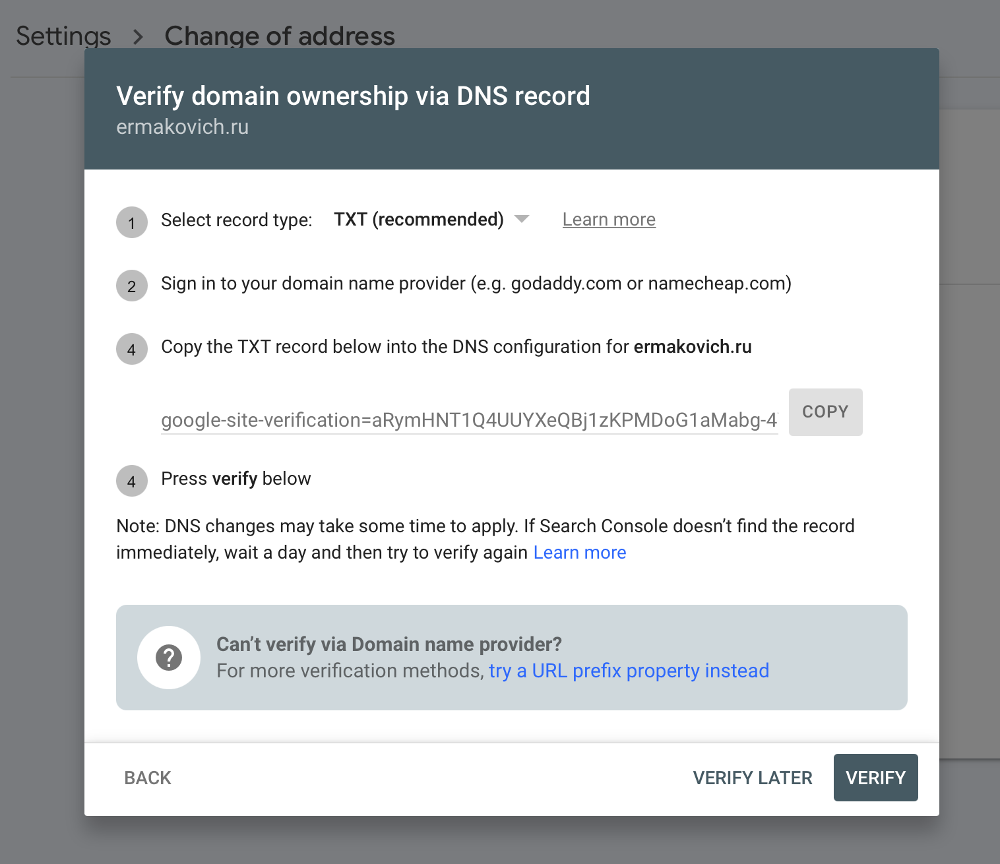

Когда-то, в 2018 году, я совершил ошибку, зарегистрировав сайт в "экзотической" доменной зоне `.name`. Тогда мне почему-то казалось, что так правильнее. Но когда мне недавно в очередной раз пришел счёт на сумму 57BYN (\~$23USD) за продления домена на год, то я слегка сконфузился. Замечу, что в 2018 году домен стоил всего 38BYN (\~$20USD). Что, согласитесь, тоже, впринципе, немало. Особенно если учесть, что сайт не приносит мне никакого дохода. Вообщем было решено перевести домен в менее "экзотическую" зону, и выбор в итоге пал на `.ru`. К моему счастью `ermakovich.ru` оказался свободен, и я его благополучно приобрел на год за 119RUB (~$2USD), что более чем в 10 раз дешевле, чем если бы я решил продлевать домен в зоне `.name`. К тому же адрес получается короче и намного легче запоминается. В конце концов, я решил переориентировать сайт на русскоязычную аудиторию, поэтому домен `.ru` оказался наиболее уместен.

Но это всё лирическое отступление. Далее я хотел бы описать собственно процедуру переезда, потому что тут есть несколько тонкостей.

Правильный переезд сайта на новый домен в моем понимании выглядит примерно так:

1. Регистрируем новый домен и публикуем на него наш сайт.
2. На старом домене устанавливаем постоянное перенаправление HTTP 301 на новый адрес.
3. Уведомляем поисковые системы о переезде на новый домен (рекомендуется).

Если с регистрацией нового домена и публикацией на него сайта всё более-менее понятно, то хочется более подробно остановиться на установке перенаправления. Я использую Netlify в качестве хостинга, и там это всё делается очень легко. Создается новый пустой сайт, в корень помещается либо файл `_redirects`, либо конфигурационный файл `netlify.toml` c описанием правил.

Файл `netlify.toml`:

```toml
[[redirects]]
from = "https://ermakovich.name/*"
to = "https://ermakovich.ru/:splat"
status = 301
force = true
[[redirects]]
from = "https://www.ermakovich.name/*"
to = "https://www.ermakovich.ru/:splat"
status = 301
force = true
```

Затем к сайту привязываем наш старый домен. Этого достаточно, чтобы весь траффик со старого домена шёл на новый.

Поисковые системы видят перенаправление HTTP 301 и способны понять, что домен поменялся. Таким образом новый домен будет ассоциироваться со старым, и рейтинг нового домена в поисковой системе не будет нулевым, а будет "подпитан" рейтингом старого домена. Желательно, чтобы хотя бы в течение месяца траффик перенаправлялся со старого домена на новый. Этого будет вполне достаточно для поисковых систем, чтобы окончательно переиндексировать весь ваш сайт и связать старый домен с новым.

## Уведомляем поисковые системы о переезде на новый домен

Чтобы сделать факт переезда на новый домен более очевидным для поисковых систем, мы можем самостоятельно уведомить их об этом. К тому же это позволит объединить данные статистики по использованию старого домена с данными статистки по новому домену. Рассмотрим на примере Google Search Console. Для смены адреса нужно зайти в настройки сайта и выбрать опцию "Change address".

<figure>
  
  <figcaption></figcaption>
</figure>

Верификация через DNS-запись происходит очень просто и быстро через тот же Netlify. Достаточно зайти в настройки домена и добавить TXT запись. В моем случае домен делегирован Netlify, то есть name-сервера находятся на стороне Netlify, поэтому запись добавляется именно там. Если бы домен не был делегирован, то запись необходимо было бы добавлять на стороне регистратора доменного имени.

Смена адреса занимает некоторое время, и пока процесс не будет закончен, старый сайт отображается как `"This site is currently moving to ermakovich.ru"`.

Вот, собственно, и всё.
