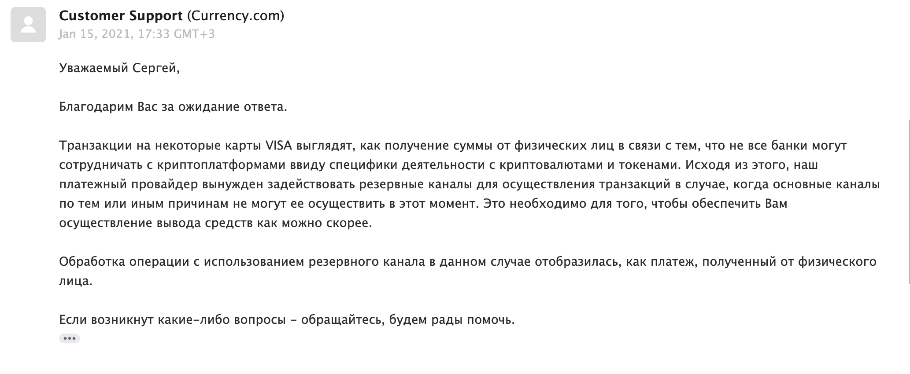
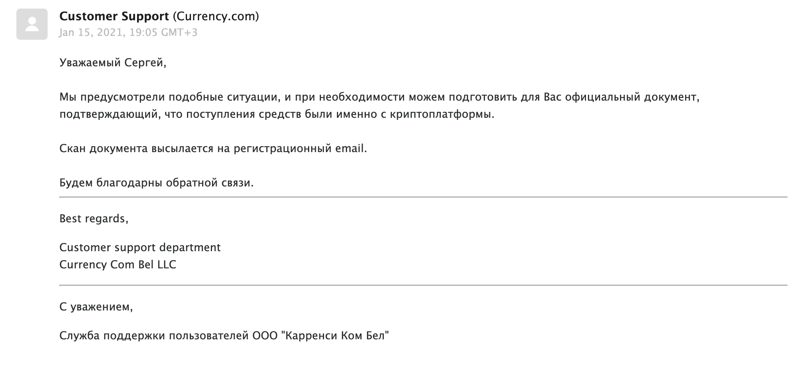

Продолжение [предыдущего поста](/posts/currency-com) об использовании криптобиржи [Currency.com](https://currency.com). Получил ответ от техподдержки по поводу поступления от физлица:

<figure>
  
  <figcaption>Ответ от техподдержки</figcaption>
</figure>

В ответ я поинтересовался какие белорусские банки лишены данной специфики. Ведь хотелось бы избежать уплаты подоходного налога от продажи криптовалюты. Если средства приходят "как бы" от физлица, то у налоговой могут возникнуть вопросы. На что получил следующий ответ:

<figure>
  
  <figcaption>Ответ от техподдержки 2</figcaption>
</figure>

Ок, в общем платежным провайдером используется схема с физлица, чтобы избежать возможных проблем. Так и непонятно правда, есть ли банки, которые поддерживают получение средств от юр. лица напрямую? Либо это проблема именно VISA, и MasterCard лишен данной проблемы? В любом случае радует, что биржа готова предоставить официальную выписку, и техподдержка работает оперативно и прозрачно. Пока сложилось положительное впечатление, что криптобиржа следит за своей репутацией.

Поделитесь пожалуйста своим опытом и впечатлениями от использования [Currency.com](https://currency.com), если они есть. Особенно интересует что касается юридических аспектов, если доводилось сталкиваться с налоговой.
