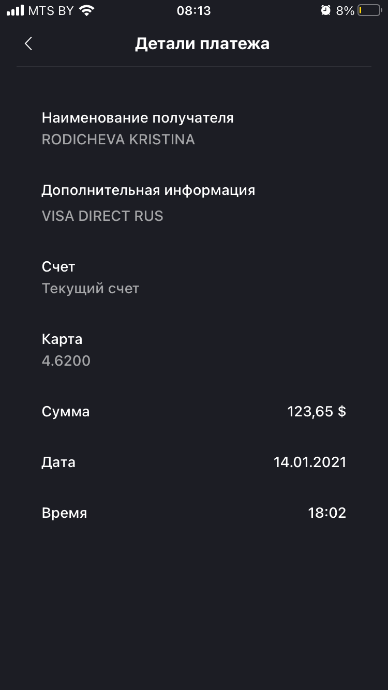
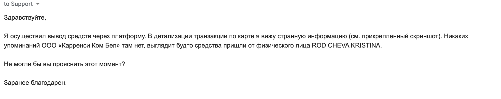

Задача: небольшое кол-во ETH нужно поменять на USD и вывести на банковскую карту, желательно с минимальными комиссиями. У меня не было раньше как такового опыта использования криптобирж, кроме децентрализованной IDEX. В то же время я живу в Беларуси и много слышал про [Currency.com](https://currency.com). Деятельность этой криптобиржи регулируется действующим законодательством РБ, поддерживается вывод на банковские карты. Вообщем решено было попробовать.

Процесс регистрации и верификации аккаунта занял больше всего времени. Запрашивались документы, подтверждающие личность, потом они проверялись некоторое время.

Процесс пополнения ETH кошелька прошел быстро и безболезненно. Минимальная сумма для пополнения была 0.03 ETH. Я завел 0.1 ETH. Создание заявки на продажу тоже происходит очень быстро и интуитивно.

В целом хочу сказать, что и сайт и приложение сделаны довольно качественно и профессионально, говорю это как веб-разработчик. Все события сопровождаются push-уведомлениями. Мне очень понравилась высококонтрастная схема дизайна UI и интуитивность. Интерфейс не перегружен лишними элементами.

Но вернемся непосредственно к процессу вывода средств. Чтобы вывести деньги на карту нужно сначала пополнить баланс хотя бы раз с этой карты. Минимальная сумма для пополнения 10 USD для долларовой карты. Сразу после пополнения карта была автоматически зарегистрирована и отобразилась в списке доступных способов для вывода средств.

Комиссия в моем случае составила 2.4% от суммы плюс \$3. Вполне приемлемо, учитывая что налогом доход от крипты на данный момент у нас не облагается. Сам вывод средств произошел в течение часа. И тут странная ситуация. Деньги на карте видны, транзакция отображается. Хотя на банковском карт-счете транзакции пока не видно, соответсвенно деньгами пока воспользоваться нельзя. Но еще больше вопросов у меня возникло, когда я увидел детали транзакции:

<figure>
  
  <figcaption>Платеж пришел от некоей RODICHEVA KRISTINA</figcaption>
</figure>

Выразил свое удивление в письме в техподдержку:

<figure>
  
  <figcaption>Письмо в техподдержку</figcaption>
</figure>

Обещали ответить в течение 1-2 дней. Напишу отдельным постом что ответят, либо дополню этот пост.

Вообщем первый опыт использования можно назвать положительным, хотя остаются некоторые открытые вопросы.
