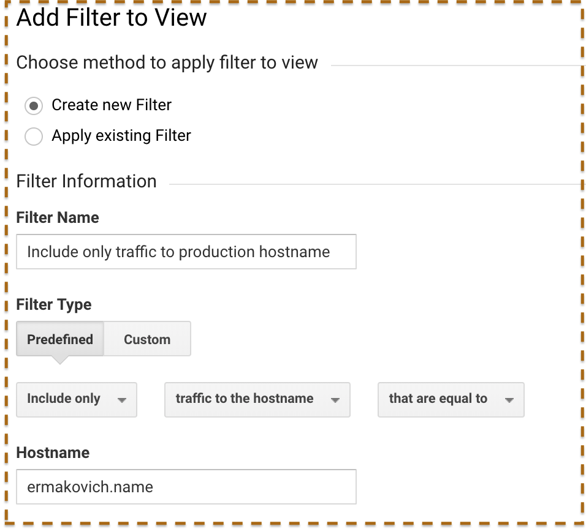

Currently I'm using [Netlify](https://netlify.com/) for hosting this website, and it's pretty awesome. Recently I did a bunch of small updates to my site (mainly due to integrating [Renovate](https://renovatebot.com/)) and I noticed a spike of traffic in GA dashboard. This site has very low traffic at the moment, so it was pretty notable.

After I confirmed this traffic is from Netlify, I started searching for possible ways to exclude it from analytics. In order to do this we need to understand how this traffic is different from regular traffic. It turns out it's quite easy, since Netlify is using custom `hostname` when doing it's internal checks. In my case most visits from Netlify have hostname like `master--ermakovich.netlify.com`. By the way, I noticed that that there are also many visits with hostname not set at all. I believe this is also some sort of bot traffic, that should be ignored.

So the solution in our case is pretty simple. Just go to GA admin settings and create filter to only include traffic to our public hostname. Any visits where hostname is different or missing will be ignored. Here is an example of filter configuration for my case:

<figure>
  
  <figcaption>Example of filter configuration</figcaption>
</figure>

Hope this helps. If you have any questions — feel free to contact me.
