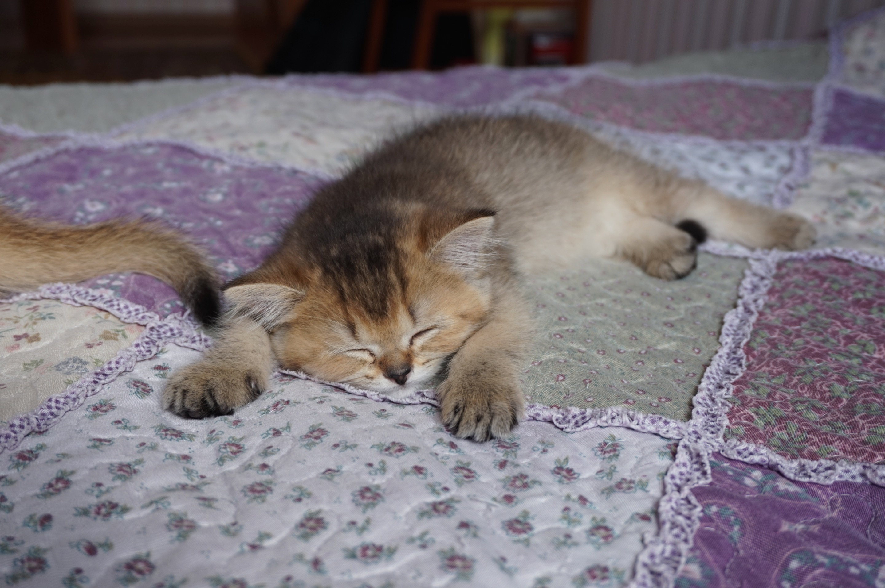
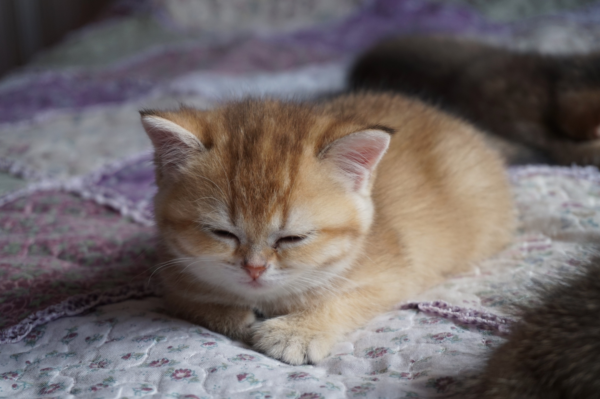
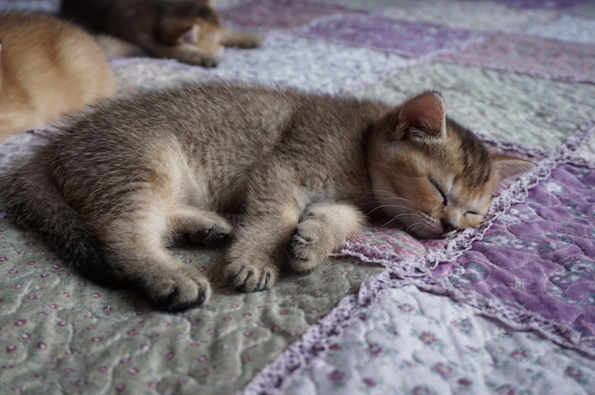
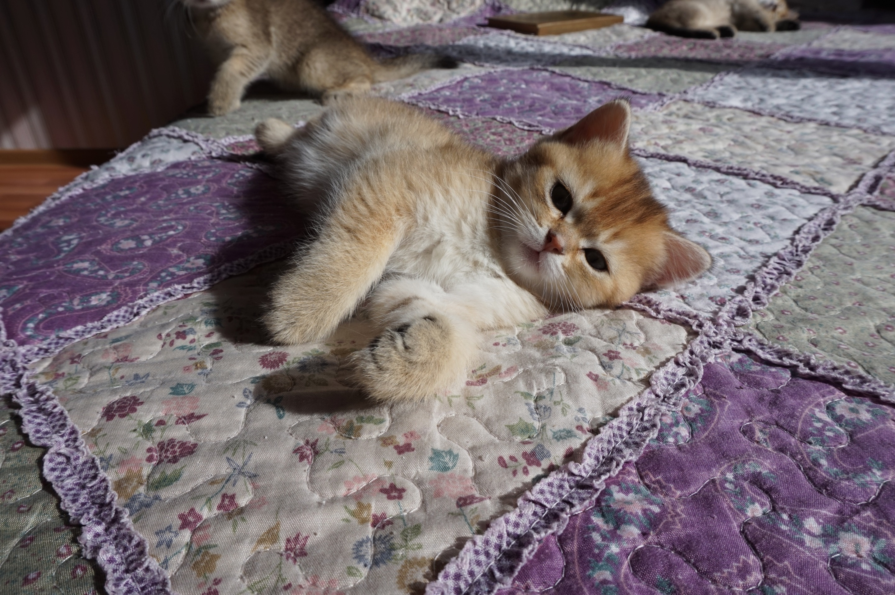

UPD: Котята проданы!

Наша кошка Бетти родила четырех очаровательных котят! Они уже подросли - им почти 2 месяца от роду. Теперь мы их неспешно распродаём. Котята очень классные, игривые, сообразительные. Пользуются лотком полностью самостоятельно! Цена за котёнка - 250р.

## Фото

<figure>
  
  <figcaption>1. Малыш-"единичка". Самый прыгучий и озорной.</figcaption>
</figure>

<figure>
  
  <figcaption>2. Малыш-"двоечка". Единственная девочка.</figcaption>
</figure>

<figure>
  
  <figcaption>3. Малыш-"троечка". Самый любознательный.</figcaption>
</figure>

<figure>
  
  <figcaption>4. Малыш-"четвертыш". Самый могучий и бесстрашный.</figcaption>
</figure>

Еще больше фото [тут](https://photos.app.goo.gl/k1aGQoMoMxjR8S6M6).
