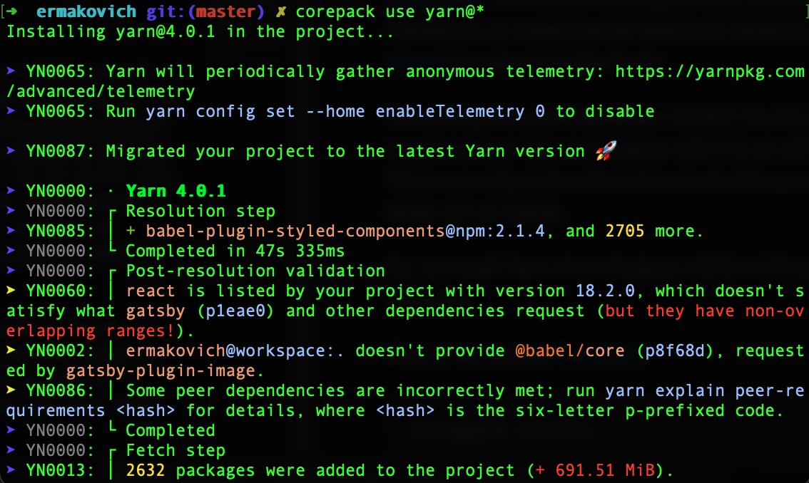

The recommended (and seems to be the only) way of installing modern release of Yarn accordingly to the [docs](https://yarnpkg.com/getting-started/install) is using [Corepack](https://nodejs.org/dist/latest/docs/api/corepack.html). This seems to be quite odd, since Corepack is still marked as an experimental feature in Node.js. However there is a [thread](https://github.com/nodejs/corepack/issues/104) to make it stable finally.

I'm writing this post, because I haven't found instructions how to install modern Yarn on Node.js v20 LTS on official resources. There are only instructions how to do this assuming you have Node v21 or higher.

So, to install Yarn v4 on Node.js v20.9.x LTS you have to do the following.

First of all, make sure to uninstall your global Yarn instance. Uninstalling depends on the way how you installed it. In my case it was done via Homebrew.

After that enable [Corepack](https://nodejs.org/dist/v20.9.0/docs/api/corepack.html):

```sh
corepack enable
```

Then tell Corepack to use latest version of Yarn as a package manager:

```sh
corepack use yarn@*
```

WOW, console output when installing Yarn looks like you are launching a missile to the space.



Now let's see what's changed in our Yarn v1 project after that. The most important changes are:

- `"packageManager"` entry added to `package.json`
- `yarn.lock` file updated to the modern format
- `.yarn` directory added (which we should ignore in git)
- `.yarnrc.yml` file added

At this point we are done. You may need to make extra steps to update you CI/CD pipelines.

## Bonus: updating Github actions

After we made these changes we need to update Github actions (if we have any), because Corepack is not enable by default, as mentioned previously.

In my case changes to CI pipeline simply look like this:

```yaml{7}:title=ci.yml
steps:
  - uses: actions/checkout@v4
  - uses: actions/setup-node@v4
    with:
      node-version-file: .nvmrc
  - run: |
      corepack enable
      yarn --frozen-lockfile
      yarn lint
```

However I got an interesting warning when running the workflow:

> The --frozen-lockfile option is deprecated; use --immutable and/or --immutable-cache instead

What a pity! I always loved how cool this "frozen lockfile" sounds. But let's update the command to get rid of the warning:

```yaml{8}:title=ci.yml
steps:
  - uses: actions/checkout@v4
  - uses: actions/setup-node@v4
    with:
      node-version-file: .nvmrc
  - run: |
      corepack enable
      yarn --immutable
      yarn lint
```

Cool, so we are done. I can't tell that I see much difference locally, but Github actions now seems to be running much faster! What a breeze.

## Conclusion

Yarn v1 (Yarn Classic) is already in maintenance-only mode and not getting any new cool features and performance improvements. You should upgrade from Yarn v1 if you haven't done it yet, or migrate to alternatives, like [pnpm](https://pnpm.io).

The only inconvenience right now is the need of enabling Corepack, but it should change very soon.
