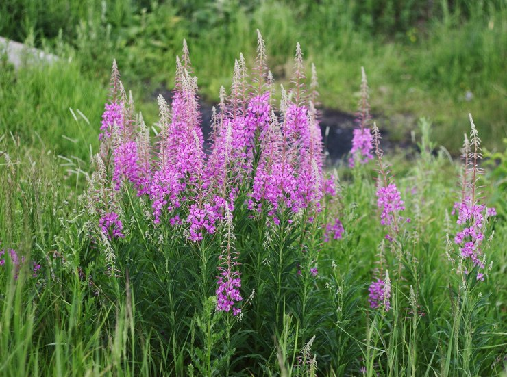
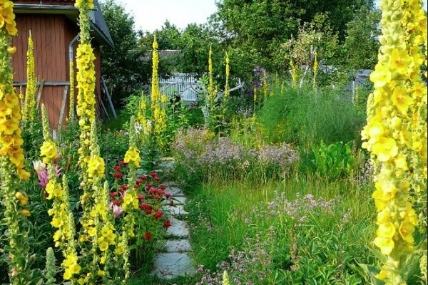
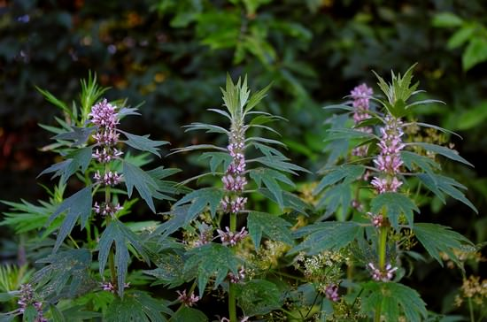
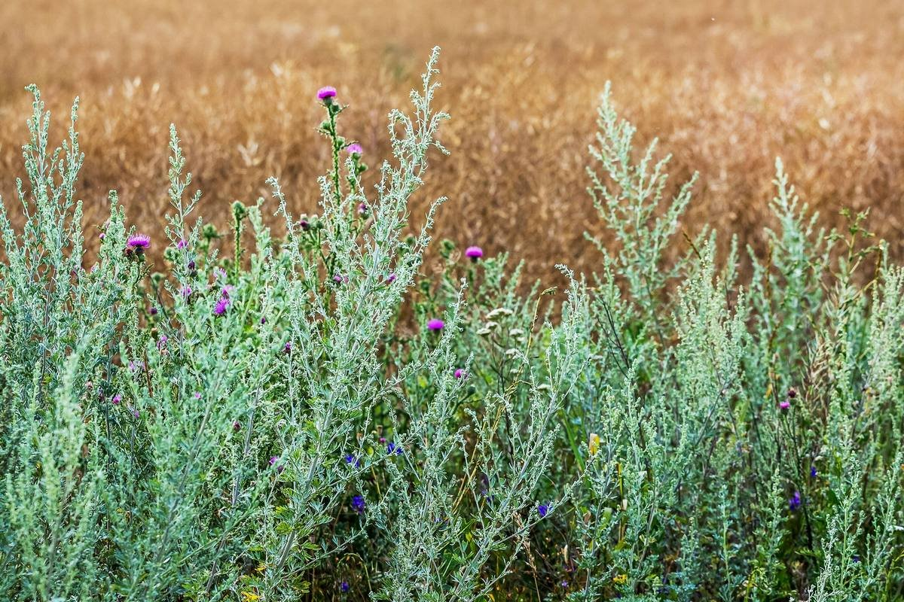

С приходом настоящих зимних морозов до -20С как-то резко обострилась тоска по лету, по загородной жизни. Этим летом мы купили деревенский дом в Столбцовском районе. С домом в придачу по документам шло 25 соток земли, хотя по факту кажется там все 40. Также предыдущий хозяин оставил нам 3 семьи пчел. Для меня это было приятным бонусом, поскольку некоторый опыт с пчелами у меня уже был, и всегда хотелось иметь возможность кушать собственный мёд. Участок не эксплуатировался агрессивно в сельскохозяйственном плане, было лишь пару небольших грядок с клубникой, помидорами, картошкой. Большую часть участка занимает плодовый сад со взрослыми деревьями, кусты с ягодами, а также небольшие лужайки и заросли разных растений. Поскольку пчелам нужно где-то собирать нектар, то планируется это так и оставить. Вообще в далеких планах есть создание пермакультурного ландшафта с большим биоразнообразием, с упором на медоносные растения. А пока я хотел бы рассказать о некоторых интересных дикорастущих растениях, которые уже растут у нас на участке.

### Иван-чай (лат. Chamaenerion)

Иван-чай, он же кипрей. Многолетник. Вырастает высотой до 2м. Красивое растение и прекрасный медонос. Цветет длительное время. Тёплыми вечерами источает приятный аромат. Листья можно заготавливать на чай. Растет всего в двух местах на участке, поэтому тщательно оберегается.

<figure>
  
  <figcaption>Иван-чай (фото для иллюстрации)</figcaption>
</figure>

### Коровяк (лат. Verbáscum)

Очень красивое растение с высоким прямым стеблем усыпанным яркими цветками и широкими раскидистыми листьями у самого основания. Зацветает на второй год. Может достигать в высоту до 3м, особенно когда растет обособленно. По моим наблюдениям пчелы его обходят стороной, хотя в некоторых источниках видел упоминание его как медоноса. Возможно зависит от разновидности.

<figure>
  
  <figcaption>Коровяк (фото для иллюстрации)</figcaption>
</figure>

### Пустырник (лат. Leonurus)

Прекрасный медонос с длительным периодом цветения. Также имеет лекарственную ценность. В высоту достигает до 2м.

<figure>
  
  <figcaption>Пустырник (фото для иллюстрации)</figcaption>
</figure>

### Полынь горькая (лат. Artemísia absínthium)

Многолетнее растение, не пестрящее цветами, по при этом очень красивое, и имеющее потрясающий аромат, особенно проявляющийся в жаркую погоду. Небольшая веточка полыни, добавленная в банный веник, придаст ему неповторимый аромат. Также очень полезно мыть полы с отваром полыни для профилактики домашних паразитов.

<figure>
  
  <figcaption>Полынь горькая (фото для иллюстрации)</figcaption>
</figure>

### Зверобой (лат. Hypericum)

Многолетнее растение, богатый источник пыльцы для пчел. Можно добавлять небольшое количество зверобоя в чай, если он не вызывает аллергических реакций.

<figure>
  
  <figcaption>Зверобой (фото для иллюстрации)</figcaption>
</figure>

Это конечно не все растения. Пожалуй, перечислил наиболее интересные и вспомнившиеся мне сейчас, сидя в городской квартире. На участке растет еще много других интересных растений, о которых я обязательно еще расскажу.
