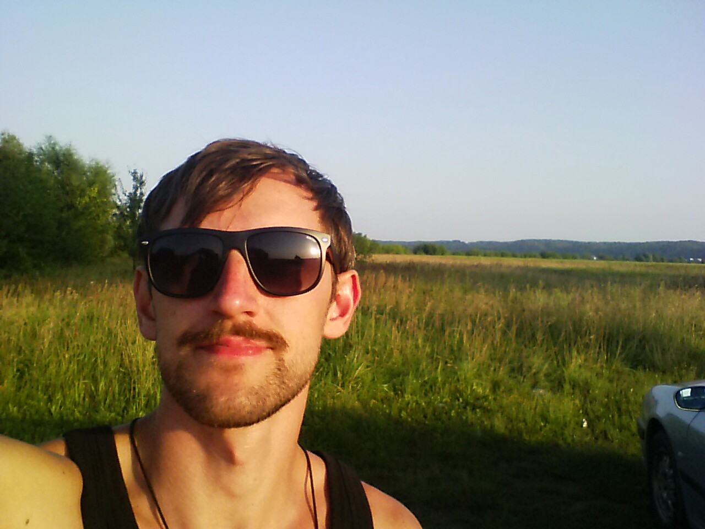
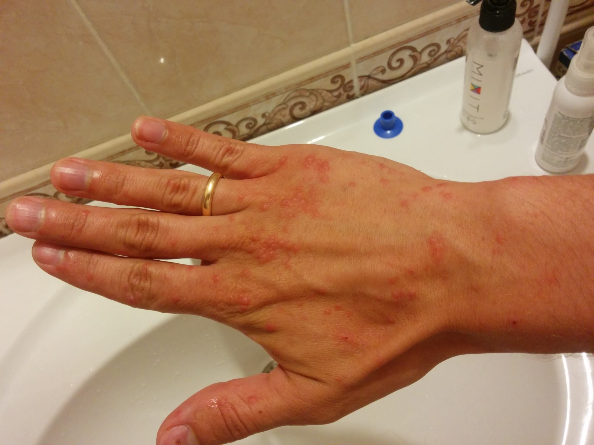
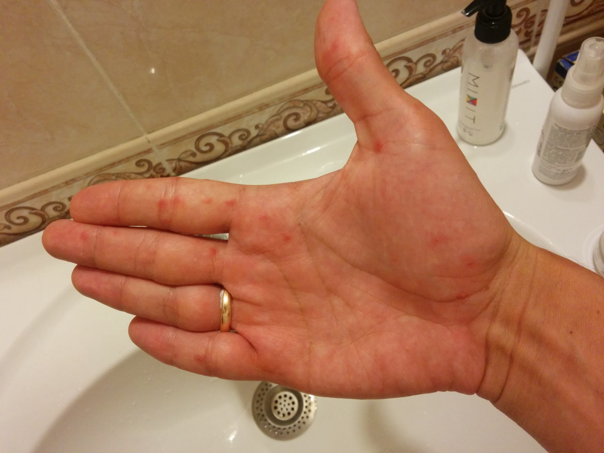
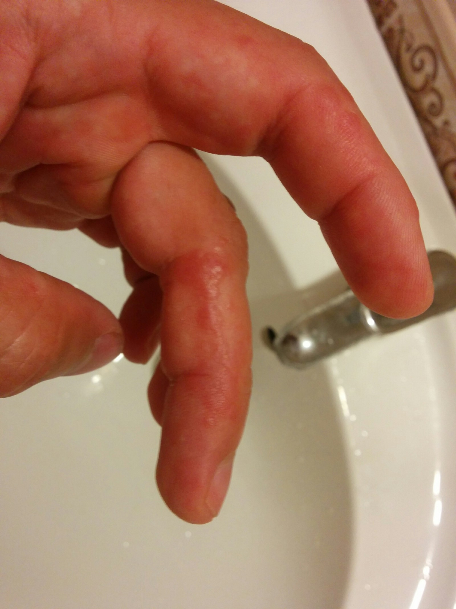
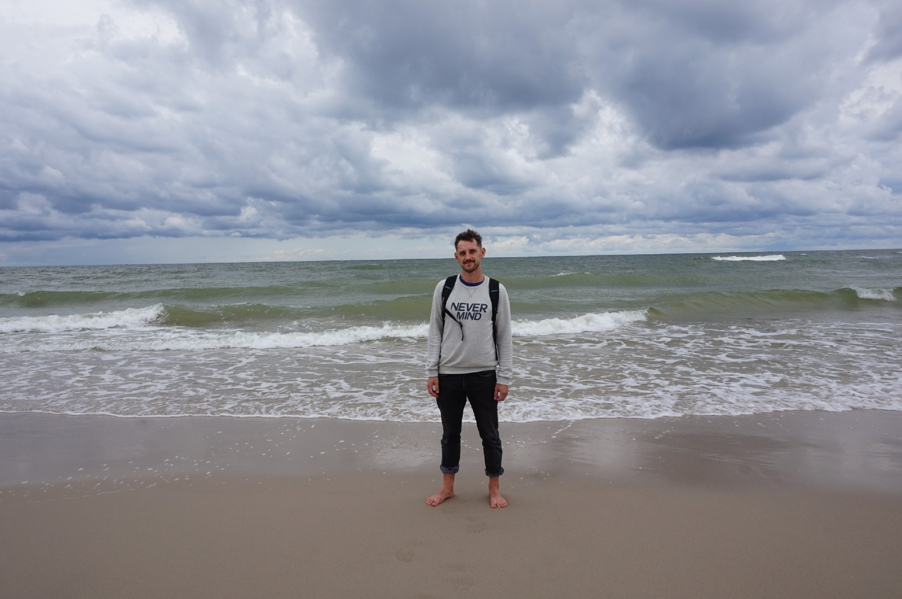
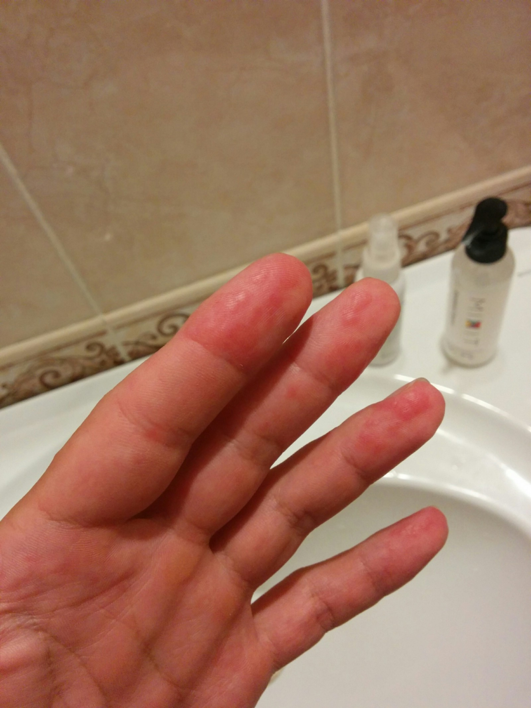
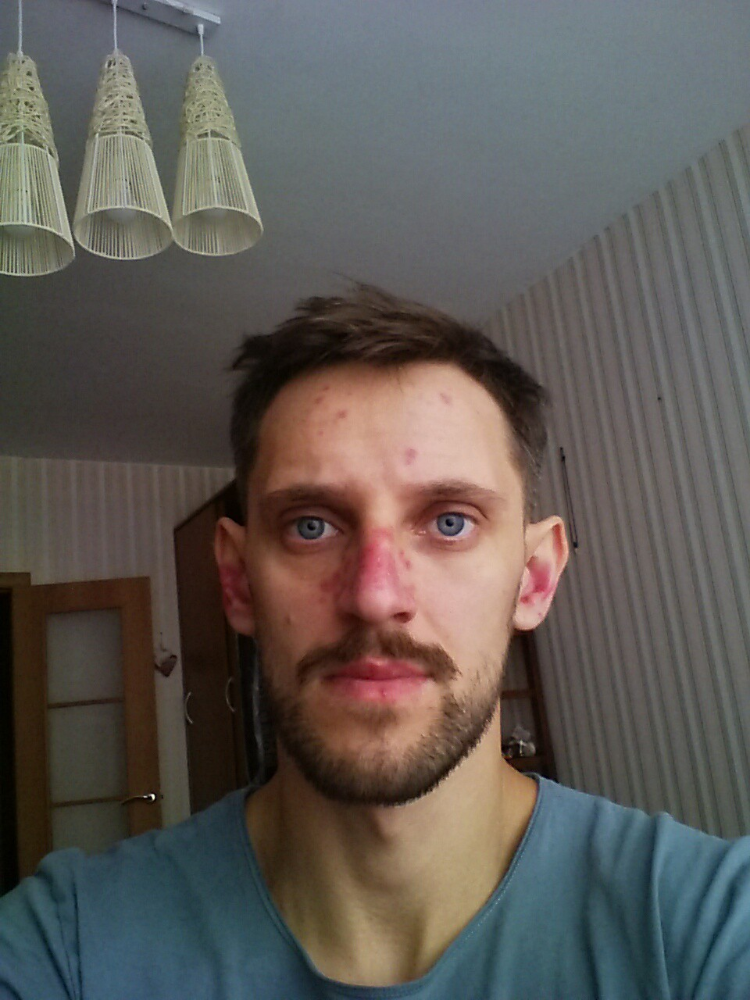
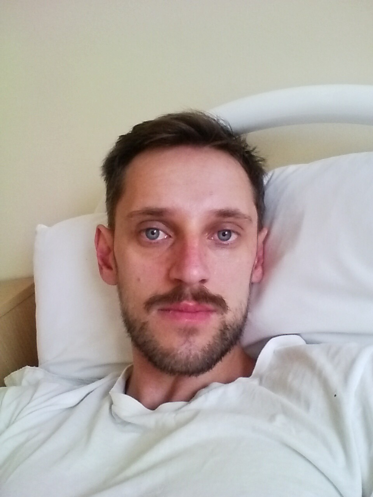

Недавно я попал в больницу, где мне поставили довольно неприятный диагноз - *красная дискоидная волчанка*. Я не буду описывать здесь данное заболевание, поскольку в интернете и так довольно много информации. Но ввиду его относительной редкости мне показалось, что будет полезно и интересно описать события, предшествовавшие моему попаданию в больницу.

### Предыстория

Итак, всё началось около месяца назад во время поездки в Могилёв на выходные. Погода стояла прекрасная и времени свободного было много. Поэтому было решено поехать на Днепр порыбачить, покупаться. Вообщем отдохнуть на природе, на солнышке. Кстати, это лето в Беларуси выдалось вообще на удивление очень солнечное и тёплое, как мне кажется.

<figure>
  
  <figcaption>День был действительно прекрасный</figcaption>
</figure>

Вечером, когда вернулся домой, почувствовал лёгкое недомогание. На ноге проявился как будто след от укуса, кожа в этом месте сильно опухла, нога начала болеть и чесаться. Хотя я не чувствовал, чтобы меня что-то кусало, кроме комаров. Но от комаров у меня такого никогда не было. Ночью меня слегка лихорадило. А на утро почувствовал себя нормально, хотя зуд и покраснения остались.

По всем признакам я пришёл к выводу, что меня атаковали паразиты церкарии. Во время рыбалки я перемещался в том числе по воде вдоль берега, ноги были оголены. Места, по которым я ходил были с относительно стоячей водой, хоть это и река. Много надводной и подводной растительности. Еще там плавали утки. К тому же у меня появилось раздражение на пальцах левой руки, которыми я в основном контактировал с приманкой и леской, и которые, в свою очередь, контактировали с водой.

Еще пару дней я чувствовал себя весьма скверно. Ломило тело, периодически поднималась температура до 38, побаливали лимфоузлы под скулами, жутко болела голова. Потом нога постепенно прошла, перестала чесаться и болеть. Но раздражение на пальцах оставалось.

К врачу было решено обратиться через пару дней после того, как появились новые высыпания, но уже на правой руке. В добавок ко всему появился очень болезненный стоматит на слизистой во рту в трёх разных местах. Было очень тяжело принимать пищу. К тому же, если не изменяет память, уже тогда у меня появились болезненные ощущения и покраснения на ушах.

<figure>
  
  <figcaption>Сыпь на правой руке</figcaption>
</figure>

<figure>
  
  <figcaption>Сыпь на ладони правой руки</figcaption>
</figure>

<figure>
  
  <figcaption>Сыпь на пальцах левой руки</figcaption>
</figure>

Я поехал в Синлаб к дерматологу. Во время осмотра обнаружили также небольшие высыпания на коленях и локтях. Врач поставил мне диагноз _многоформная экссудативная эритема_. Сказал, что должно пройти само со временем, но нужно немного полечиться. Назначил курс детоксикации организма - внутримышечно уколы глюконата кальция, таблетки "белый уголь" и строгую диету. От стоматита для облегчения боли посоветовал дентальную адгезивную пасту. А также избегать солнца. Направил на анализы, сразу предупредив, что они будут плохие ввиду интоксикации.

Я начал курс лечения, а через пару дней поехал сдал анализы. Они оказались действительно плохими - значительно повышен уровень моноцитов и С-реактивного белка, а также некоторые другие параметры ([анализы](results.pdf)).

Лучше от лечения мне как-то особо не становилось. Сыпь не проходила, стоматит тоже. Тело периодически немного ломило и было ощущение повышенной температуры, хотя градусник как ни странно показывал нормальную. Поэтому как только появились результаты анализов, то я поехал на повторный прием к врачу. Врач сказал, что результаты указывают на наличие вирусной инфекции в организме. Но узнать, что за вирус, к сожалению, невозможно.

Уже тогда врач, да и я сам заметили также небольшие покраснения на лице в районе носа. И тогда он назначил мне _преднизолон_ внутримышечно курсом из трех дней.

### Ремиссия

После преднизолона всё волшебным образом стало проходить, даже стоматит начал стремительно заживать и меньше болеть. Это было огромным облегчением.

Вообщем я почувствовал себя вскоре полностью выздоровевшим и вернулся к нормальной жизни. Сыпь как бы "сдулась", на её месте остались просто плоские пятнышки. Я перестал строго соблюдать диету и стал опять проводить довольно много времени на солнце.

### Возвращение симптомов

Но через пару недель начало становиться опять хуже. Во-первых стала шелушиться кожа на ушах, и немного на носу. Во-вторых появилась боль в горле при глотании. Но не такая, как обычно при ангине, а немного другая. Я пошёл к ЛОРу в поликлинику, но они ничего не нашли, посоветовали лишь рассасывать таблетки от горла и попить противоспалительное.

Я чувствовал, что нужно как-то укрепить организм, и как раз тогда мне подвернулись можно сказать халявные авиабилеты до Калининграда. Было решено съездить на море в Зеленоградск на 5 дней, пока не наступила осень, в надежде что морская вода, солнце и воздух пойдут на пользу.

Я совершенно забыл тогда про слова врача о том, что нужно избегать солнца. Ведь у меня как бы всё прошло тогда. Я думал, что я здоров.

После пары дней на море у меня стала еще сильнее шелушиться кожа на лице и ушах. При этом я бы не сказал, что в эти дни было какое-то сильное солнце. Но я довольно много времени проводил на улице. Один раз даже искупался. Вода была теплая, но когда вылез, то немного замёрз.

<figure>
  
  <figcaption>Экскурсия на Куршскую косу, пятен на лице еще не заметно</figcaption>
</figure>

После экскурсии на Куршскую косу я решил сходить в общественную баню, попариться хорошенько, в надежде что это поможет от шелушения. Но, к сожалению это не помогло, а как мне кажется наоборот лишь всё усугубило. Пятна на лице проявились во всей красе. Эритемы на пальцах тоже начали проявляться сильнее.

<figure>
  
  <figcaption>Эритемы на пальцах в новых местах</figcaption>
</figure>

<figure>
  
  <figcaption>Так я выглядел, когда вернулся в Минск</figcaption>
</figure>

По возвращении в Минск я сразу же побежал к врачу, правда уже к другому, но тоже в Синлаб. Врач озадаченно посмотрела на меня, сфоткала, посоветовалась сразу с каким-то крутым знакомым профессором по мессенджеру. У них возникло подозрение на волчанку. Попросила сразу сдать анализы ANA и dsDNA, дабы исключить системную форму волчанки, как наихудший вариант. Ну и посоветовала обратиться в [ГКВД](https://kvd.by), поскольку какое-то интенсивное лечение при подозрении на подобное заболевание она назначать не имеет право, только через больницу.

Я конечно согласился, в тот же день поехал в ГКВД, который, к слову, находился поблизости. Там меня посмотрела врач поликлиники и уже на следующий день утром меня положили в стационар. Заведующий отделением, на вид очень опытный и компетентный врач, сказал, что в целом симптомы подходят под волчанку. Особенно когда я утвердительно ответил, что много проводил времени на солнце в последнее время.

Через пару дней после поступления меня еще посмотрела доцент кафедры и подтвердила диагноз. Фамилию доцента не помню. Такая полная женщина в возрасте. Это происходило в присутствии студентов, и было очень неприятно, когда она сказала, что пятна на лице полностью не пройдут. Когда говорят такое, это не может не расстроить, конечно.

### Лечение

Общие рекомендации, которые дали мне врачи, это избегать нахождения на солнце. Про целенаправленные загары можно забыть вообще раз и навсегда. Если выходишь на улицу, даже если нет особо солнца - обязательно солнцезащитный крем SPF 50+ на открытые участки кожи. Ещё завотделением сказал, что нельзя делать прививки и вводить сыворотки.

По уколам назначили дексаметазон 2мл, ксантинола никотинат 4мл и витамин то ли B6 то ли B12. Еще некоторые витамины и пищевые добавки в виде таблеток. От укола ксантинола мне было не очень хорошо. Я попросил на следующий день мне его не колоть и завотделением согласился. Но реакция на укол, как он сказал, была очень хорошая. Поэтому мол, хорошо, что сделали, посмотрели на реакцию по крайней мере.

По анализам у меня, к счастью, оказалось всё хорошо, по крайней мере признаков системной волчанки не обнаружили. Наконец-то можно было хоть немного успокоиться, а то от этих всех диагнозов уже было не по себе.

С первого же дня после укола гормонов стало лучше. Сразу прошла боль в горле при глотании, которая мучила больше недели. Также начали проходить высыпания и покраснения. Правда первые пару дней в температура поднималась вечером до 37.2, сильно потел во сне. Возможно это была реакция на лекарства, плюс стресс.

Еще я хочу сказать, что мне **очень** помог _декспантенол_. Спасибо маме, что посоветовала помазать лицо и уши. Никто из врачей почему-то не подсказал воспользоваться им. Мне кажется, если бы я этого не сделал, то у меня могли бы остаться рубцы, потому что шелушение было очень сильное.

К сожалению, после того, как начали колоть гормоны, появились поражения в слизистой рта. Не знаю, взаимосвязано это или нет. Судя по информации в интернете, такие поражения являются вполне типичными для пациентов с красной дискоидной волчанкой. Каждое утро хожу к стоматологу и она мажет мне слизистую метиленовым синим. Также ополаскиваю слизистую хлоргексидином после каждого приема пищи. Поражения никак не беспокоят, они совершенно безболезненные, но тем не менее ежедневные уколы дексаметазона не позволяют избавиться от них, что возможно указывает на другую этиологию.

### На данный момент

Сейчас уже заканчивается вторая неделя, как я в больнице. Гормоны прекратили давать через 10 дней. Завотделением настоял, чтобы всё-таки вернули ксантинол пару дней назад в меньшей дозировке 2мл для понижения фотосенсибилизации и улучшения циркуляции микрокапилляров. В малой дозировке укол практически не чувствуется, переносится значительно легче. Главное делать сразу после еды, ни в коем случае не натощак.

Симптомы на лице практически прошли, осталась еле заметная пигментация в нескольких местах. Доцент, к счастью, все-таки ошиблась на этот счёт. Уши полностью прошли. В слизистой остаются поражения, но мне кажется, после отмены гормонов они стали уменьшаться.

<figure>
  
  <figcaption>На данный момент</figcaption>
</figure>

Ментально и физически чувствую себя очень хорошо. Возможно сказывается больничный режим и четкий распорядок дня, питания и отдыха. Вообщем активно иду на поправку.

Персонал в больнице хороший. Условия содержания и питание отличные. Контингент в моей палате, да и в отделении в целом приличный.

### P.S.

Мне трудно сказать чем я болею на данный момент, и как долго еще пробуду в больнице.

Если диагноз поставлен правильно (в чем я сомневаюсь), то придется довольно круто поменять свой образ жизни, потому что я активный человек и очень люблю солнце и природу. Но я не расстраиваюсь. Даже в таком случае, если следить за собой, строго соблюдать рекомендации врачей и контролировать заболевание, то прогноз вполне благоприятный.
