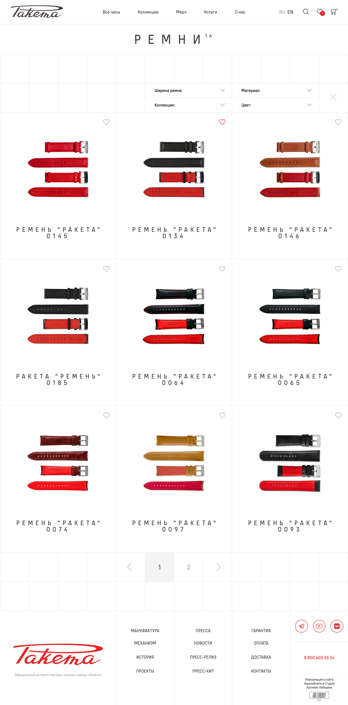
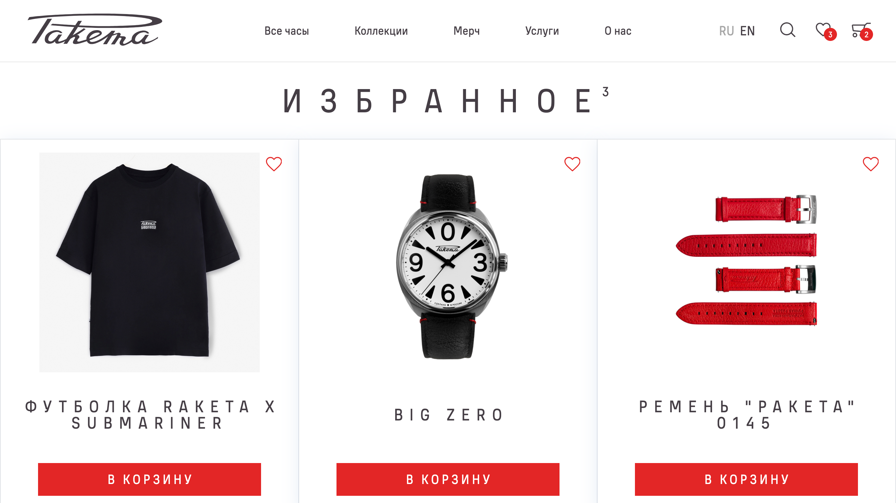
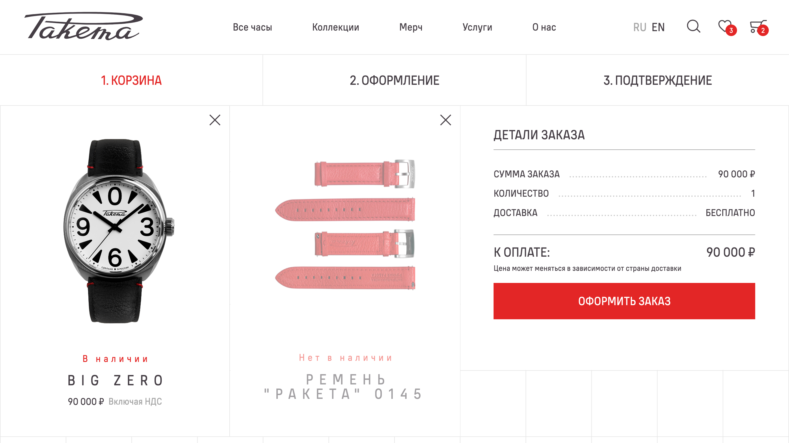
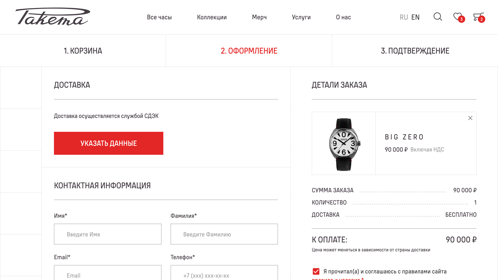

Новый сайт часового завода Ракета представляет собой довольно большой сайт производителя с каталогом продукции и функциями монобрендового интернет-магазина, в котором можно просмотреть и заказать продукцию, производимую часовым заводом.

В данном проекте, совместно с диджитал-агентством Pena, мне довелось реализовывать модули, связанные с функциями интернет-магазина. Я подключился к проекту на стадии, когда уже была реализована статическая часть сайта на Gatsby.

Разработка осуществлялась по макетам в Figma, разработанным в дизайн-студии Артемия Лебедева.

В этом проекте мной были реализованы:

- каталоги товаров (часы, ремни, мерч) с функциями поиска, фильтрации и просмотра
- страница глобального поиска по товарам
- страница товара и логика добавления в корзину и избранное
- страница избранного
- страница корзины и модуль оформления заказа
- интеграция службы СДЭК и Google Places для доставки по России и миру соответственно
- интеграция платежной системы
- переключение между языковыми версиями сайта

Также мне довелось устранять некоторые дефекты на уже разработанных страницах, улучшать производительность сайта и скорость сборки проекта, улучшать работу с файлами локализации.

## Сложности

Основные сложности заключались в нетривиальных дизайн-решениях (наличие вертикального выравнивания по сетке), сложной и длительной сборке Gatsby-проекта, сложности интеграции с API Битрикса, а также требование к мультиязычности и мультирегиональности сайта (разные цены и склады для разных регионов).

## Результаты

Пока рано говорить об окончательных результатах, поскольку сайт проекта еще не запущен и проходит стадию доработок, но что касается моего участия в проекте, то можно выделить следующие основные результаты:

- модули сайта реализованы согласно дизайну и требованиям, произведена build-time и run-time интеграция с API Битрикса
- улучшена производительность сайта
- значительно улучшена средняя скорость сборки проекта за счет использования многоуровневого кэширования
- улучшены CI/CD-процессы
- упрощена работа с файлами локализации

Ниже приводу скриншоты некоторых страниц сайта:

<figure>
  
  <figcaption>Страница каталога</figcaption>
</figure>

<figure>
  
  <figcaption>Страница товара</figcaption>
</figure>

<figure>
  
  <figcaption>Избранное</figcaption>
</figure>

<figure>
  
  <figcaption>Корзина</figcaption>
</figure>

<figure>
  
  <figcaption>Оформление заказа</figcaption>
</figure>
